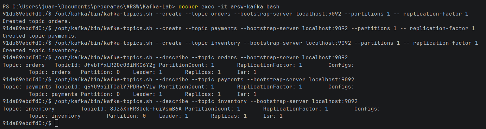
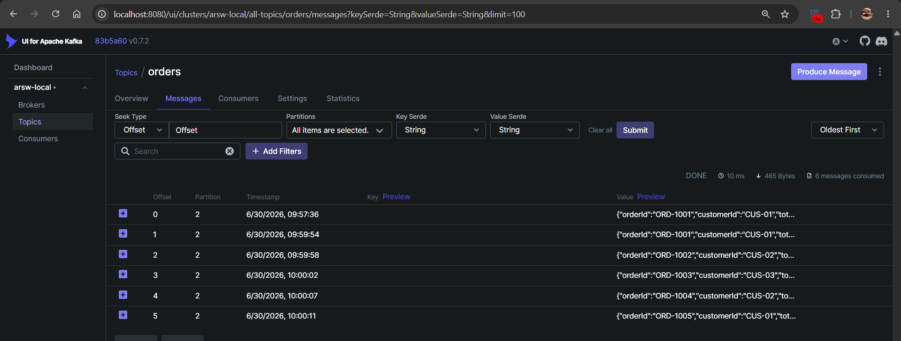
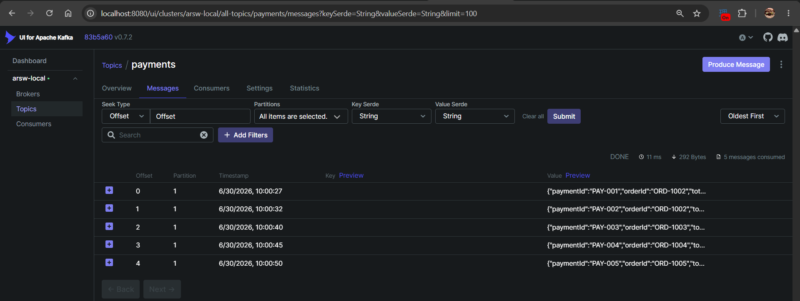
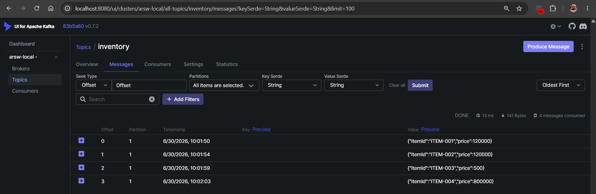

# Apache Kafka y Arquitecturas Orientadas por Eventos

## Actividad 1. Análisis de comunicación

Para una tienda en línea, clasifique qué procesos deberían ser síncronos, asíncronos o híbridos: consultar
productos, crear pedido, validar pago, enviar notificación, actualizar analítica y registrar auditoría. Justifique
brevemente su decisión.

### Consultar productos

- Asincrónico: Es un evento y no requiere ningún orden en específico, únicamente consultar la base de datos y esperar que llegue el resultado.

### Crear pedido

- Sincrónico: Se debe verificar que el producto exista primero para poder crear el pedido.

### Validar pago

- Asincrónico: El cliente puede haber terminado de hacer su pedido mientras espera que se confirme el pago.

### Enviar notificación

- Asincrónico: No se requiere de ningún orden, solo que las notificaciones sean enviadas.

### Actualizar analítica

- Hibrido: Se pueden hacer todas las consultas de información necesarias para actualizar la analítica de manera asincrona, se debe esperar que se recolete toda la información para realizar el analisis.

### Registrar auditoria

- Asincrónico: Cada servicio se puede estar registrando individualmente, no hay ningun orden específico para hacerlo, solo se necesita que lo que se haga quede registrado.

## Actividad 3

Cree los topics orders, payments e inventory. Publique al menos cinco eventos JSON y verifique en Kafka UI su
topic, partición, offset, clave y contenido.

### Creación de topics

### Visualización de mensajes

