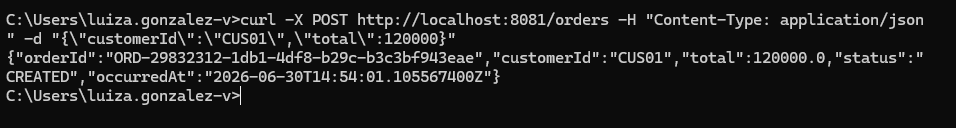
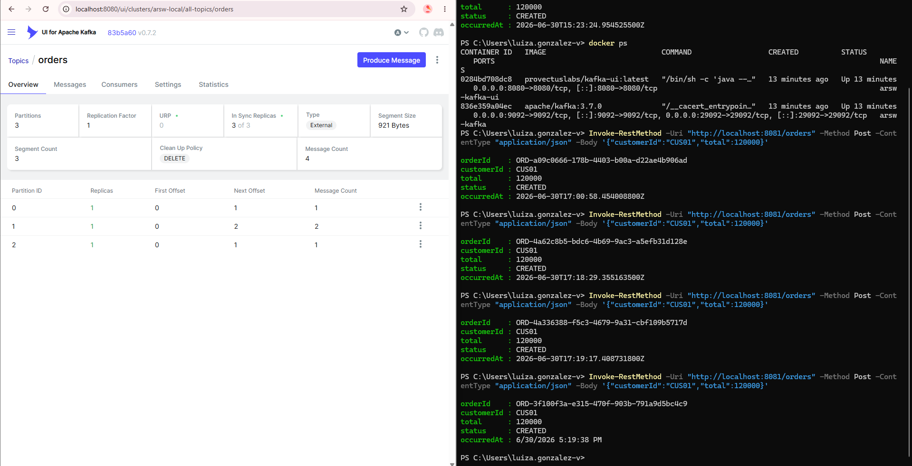
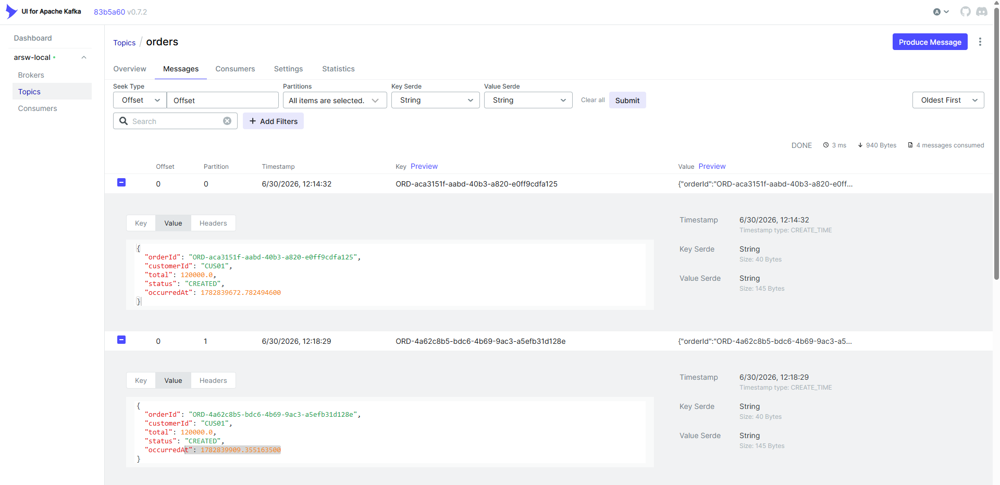
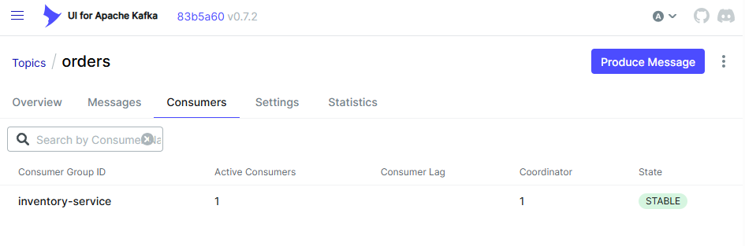

# Kafka-Lab
ARSW

# Apache Kafka y Arquitecturas Orientadas por Eventos

## Actividad 1. Análisis de comunicación

Para una tienda en línea, clasifique qué procesos deberían ser síncronos, asíncronos o híbridos: consultar
productos, crear pedido, validar pago, enviar notificación, actualizar analítica y registrar auditoría. Justifique
brevemente su decisión.

### Consultar productos

- Asincrónico: Es un evento y no requiere ningún orden en específico, únicamente consultar la base de datos y esperar que llegue el resultado.

### Crear pedido

- Sincrónico: Se debe verificar que el producto exista primero para poder crear el pedido.

### Validar pago

- Asincrónico: El cliente puede haber terminado de hacer su pedido mientras espera que se confirme el pago.

### Enviar notificación

- Asincrónico: No se requiere de ningún orden, solo que las notificaciones sean enviadas.

### Actualizar analítica

- Hibrido: Se pueden hacer todas las consultas de información necesarias para actualizar la analítica de manera asincrona, se debe esperar que se recolete toda la información para realizar el analisis.

### Registrar auditoria

- Asincrónico: Cada servicio se puede estar registrando individualmente, no hay ningun orden específico para hacerlo, solo se necesita que lo que se haga quede registrado.

**Actividad 2. Decisiones de configuración**

Analice una configuración con un topic orders, una partición, factor de replicación 1, mensajes sin clave y retención
de 24 horas. Identifique riesgos y proponga mejoras para un ambiente productivo.

Los riesgos al tener solo una partición en un topic son que no nos permite paralelismo. 
Al tener solo replicación 1, estamos susceptibles a fallos; en cambio, si tuviéramos más, 
nuestro sistema sería tolerante a estas fallas. El tiempo de retención es muy corto para la auditoría.
Para mejorar el ambiente, tendríamos que poner más particiones, aumentar la duración de retención de 
los eventos en el broker y el tamaño de réplicas para que nuestro sistema sea tolerante a fallas.

**Actividad 4. Trazabilidad del evento**

Documente el recorrido del evento desde la solicitud HTTP hasta el consumidor. Indique topic, clave, partición,
consumidor, Consumer Group y evidencia en Kafka UI 

## Actividad 4. Trazabilidad del evento

Documento el recorrido del evento desde la solicitud HTTP hasta el consumidor.

### 1. Levantamiento del entorno

Se ejecutan los siguientes comandos:

- docker compose up -d
- docker ps

### 2. Creación del topic

- docker exec -it arsw-kafka bash
- /opt/kafka/bin/kafka-topics.sh --create --topic orders --bootstrap-server localhost:9092 --partitions 3 --replication-factor 1

### 3. Levantamos la aplicación Spring Boot

- `mvn spring-boot:run`

### 4. Hacemos la solicitud HTTP que es nuestro productor

- curl -X POST http://localhost:8081/orders -H "Content-Type: application/json" -d "{"customerId":"CUS01","total":120000}"

El **OrderController** recibe la petición, construye un **OrderCreatedEvent** (con **orderId** autogenerado tipo UUID,
status **CREATED** y **occurredAt** con el timestamp actual) y lo delega a **OrderEventProducer**, que lo publica en el
topic **orders** usando el **orderId** como clave.

### 5. Evidencia en Kafka UI

| Campo | Valor                                                                                                                            |
|---|----------------------------------------------------------------------------------------------------------------------------------|
| **Topic** | orders                                                                                                                           |
| **Clave** | ORD-29832312-1db1-4df8-b29c-b3c3bf943eae                                                                                         |
| **Partición** | 3 particiones, el evento se asigna según hash de la clave (orderId)                                                              |
| **Consumidor** | En la clase OrderEventConsumer el metodo consume(), anotado con @KafkaListener(topics = "orders", groupId = "inventory-service") |
| **Consumer Group** | inventory-service                                                                                                                |

Vista general del topic: 3 particiones, 4 mensajes totales repartidos como 1/2/1.

Detalle de un mensaje: Key = orderId, Value = JSON con orderId, customerId, total, status y occurredAt.

Consumer Group inventory-service, 1 consumidor activo, estado STABLE.

### 6. Recorrido completo del evento

1. Cliente hace **POST /orders** con **customerId** y **total**.
2. El controllador con el metodo **createOrder()** construye el **OrderCreatedEvent** (orderId = UUID, status = CREATED, occurredAt = Instant.now()).
3. En la clase del productor**OrderEventProducer** publica el topico  **orders** por medio del metodo **publishOrderCreated()** usando **event.getOrderId()** como clave del mensaje Kafka.
4. Kafka asigna el mensaje a una partición (según hash de la clave) dentro de las 3 particiones del topic **orders**.
5. **OrderEventConsumer**, suscrito al topic **orders**  del Consumer Group **inventory-service**, lee el evento y lo imprime en consola.
6. Kafka UI confirma el evento: topic, clave, partición, offset, contenido del mensaje y estado del Consumer Group.